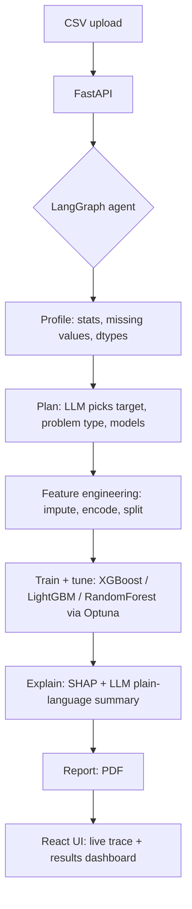

# AutoDS Agent

**Hand it a spreadsheet. It hands back a tuned model, an explanation, and a report.**

AutoDS Agent is an autonomous data science pipeline built on **LangGraph**. Upload a CSV
and the agent decides the problem type, engineers features, tunes several candidate
models with **Optuna**, explains its own results with **SHAP**, and writes a PDF report —
with a live progress trace in the UI the whole time. No manual steps in between.

  

---

## Why this exists

Most "ML portfolio" projects are a single trained model in a notebook. This one is an
**agent that makes the modelling decisions itself** — which columns to drop, which models
to try, how to explain the result to a non-technical reader — while the actual
feature-engineering and training code stays deterministic, tested, and fully visible.
See [`docs/architecture.md`](docs/architecture.md) for the reasoning behind that split.

## How it works



The planner and explainer are the only two LLM calls in the whole pipeline — and both
fall back to sensible rule-based heuristics if no `GROQ_API_KEY` is set, so the project
runs end to end with zero API keys.

## Tech stack

| Layer | Tech |
|---|---|
| Agent orchestration | LangGraph |
| LLM | Groq (Llama 3.1), optional |
| ML | XGBoost, LightGBM, scikit-learn, Optuna |
| Explainability | SHAP |
| Backend | FastAPI |
| Frontend | React 18 + Vite + Recharts |
| Reports | ReportLab (PDF) |
| Deployment | Docker / Docker Compose, Hugging Face Spaces |

## Quick start (local dev)

Requires Python 3.11+, Node 20+.

```bash
# 1. Backend
cd backend
python -m venv .venv && source .venv/bin/activate   # Windows: .venv\Scripts\activate
pip install -r requirements.txt
cp .env.example .env   # optional: add GROQ_API_KEY to enable real LLM reasoning
uvicorn app.main:app --reload --port 8000

# 2. Frontend (new terminal)
cd frontend
npm install
npm run dev
```

Open **http://localhost:5173**, upload `examples/telco_churn_sample.csv` (or your own),
and click **Run the agent**.

## Run with Docker Compose

```bash
cp .env.example .env   # optional: add GROQ_API_KEY
docker-compose up --build
```

Frontend: http://localhost:4173 · Backend: http://localhost:8000/api/health

## Deploy a live demo (Hugging Face Spaces)

The root `Dockerfile` builds the frontend and backend into a **single image** that
serves everything on one port — exactly what Hugging Face Spaces (Docker SDK) expects.

1. Create a new Space at [huggingface.co](https://huggingface.co) → SDK: **Docker**
2. Push this repo to the Space (or connect it via GitHub)
3. If you want real LLM reasoning, add `GROQ_API_KEY` as a Space **secret**
4. Also set the Space variable `PORT=7860` (the root Dockerfile defaults to 8080,
   which is Cloud Run's convention -- HF Spaces needs 7860)
5. The Space builds automatically and gives you a public URL — that's your live demo link

Hugging Face Spaces restricts writes to `/tmp`, which is exactly where this project
already keeps uploads and artifacts, so no changes are needed there.

## Deploy a live demo (Google Cloud Run)

Cloud Run is a good fit here: it's fully managed, scales to zero (so it's cheap when
no one's using the demo), and deploys straight from source using the same root
`Dockerfile` -- no separate registry step needed.

**Prerequisites:** a Google Cloud project with billing enabled, and the
[gcloud CLI](https://cloud.google.com/sdk/docs/install) installed and authenticated
(`gcloud auth login`).

```bash
# From the repo root (where the combined Dockerfile lives)
gcloud run deploy autods-agent \
  --source . \
  --region europe-west1 \
  --allow-unauthenticated \
  --memory 2Gi \
  --set-env-vars GROQ_API_KEY=your_key_here
```

- `--source .` tells Cloud Run to build the image with Cloud Build using the root
  `Dockerfile` and push it for you -- no manual `docker build`/`docker push` needed.
- `--memory 2Gi` matters here: XGBoost/LightGBM/SHAP need more headroom than Cloud
  Run's 512 MiB default, especially while Optuna is tuning several models at once.
- `--allow-unauthenticated` makes the demo URL public, which is what you want for a
  portfolio link.
- Omit `--set-env-vars GROQ_API_KEY=...` to run on the heuristic fallback instead --
  for anything beyond a quick personal demo, use `gcloud secrets` and
  `--set-secrets` rather than passing the key as a plain env var on the command line.

The command prints a `*.run.app` URL when it finishes -- that's your live demo link.
Cloud Run's free tier covers a meaningful number of requests/month, so a portfolio
demo with light traffic typically costs nothing.

## Project structure

```
autods-agent/
├── backend/
│   ├── app/
│   │   ├── main.py              # FastAPI app (routes under /api/*)
│   │   ├── job_store.py         # in-memory run/progress tracker
│   │   ├── agent/
│   │   │   ├── state.py         # LangGraph state schema
│   │   │   ├── graph.py         # graph wiring
│   │   │   ├── nodes.py         # one function per pipeline step
│   │   │   └── llm.py           # planner/explainer prompts + heuristic fallback
│   │   ├── ml/                  # profiling, feature engineering, training, SHAP
│   │   └── reports/             # PDF generation
│   ├── Dockerfile               # backend-only image (used by docker-compose)
│   └── requirements.txt
├── frontend/
│   ├── src/
│   │   ├── App.jsx
│   │   └── components/          # UploadCard, TracePanel, ResultsPanel
│   ├── nginx.conf                # reverse-proxies /api -> backend (docker-compose mode)
│   └── Dockerfile
├── docker-compose.yml            # two containers, for local dev / self-hosting
├── Dockerfile                    # ONE container, for Hugging Face Spaces / single-port hosts
├── examples/
│   └── telco_churn_sample.csv
└── docs/
    └── architecture.md
```

## Extending it

- **New problem types**: add a conditional edge after `plan_node` (LangGraph supports
  this natively) to route time-series datasets to a Prophet/ARIMA node instead of
  `train_node`.
- **Human-in-the-loop**: LangGraph's `interrupt` support can pause the graph after
  `plan_node` so a user can veto a dropped column or force a target column before
  training continues.
- **Persistence**: swap `app/job_store.py`'s in-memory dict for Redis or a database —
  the three-function interface (`create_job` / `get_job` / `update_job`) is designed to
  make that a one-file change.

## License

MIT — see [LICENSE](LICENSE).
